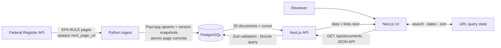
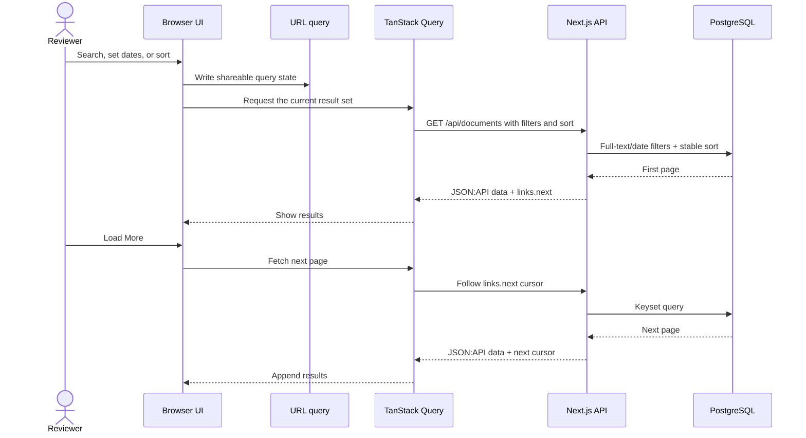

# Maiven take-home

An end-to-end EPA rule tracker: Python ingests Federal Register documents into
PostgreSQL; Next.js serves and displays a searchable, read-only library.

## Run the assessment

Requirements:

- Docker Engine with Docker Compose
- Internet access to Docker registries and the Federal Register API
- Free local ports `3000`, `3001`, `3100`, `3200`, `4317`, `4318`, `5433`, and
  `9090`

From the repository root, run:

```sh
./scripts/bootstrap-compose.sh
```

This builds the images, starts PostgreSQL, applies migrations, ingests up to 100
EPA rules, and starts the web and observability services. Open
[http://localhost:3000](http://localhost:3000).

Confirm the API is ready:

```sh
curl -fsS http://127.0.0.1:3000/api/health
curl -fsS -H 'Accept: application/vnd.api+json' \
  http://127.0.0.1:3000/api/documents
```

Useful commands:

```sh
# Run another ingest
./scripts/bootstrap-compose.sh ingest --max-unique-documents 100

# Stop services and keep stored data
./scripts/bootstrap-compose.sh stop

# Use another PostgreSQL host port
env POSTGRES_PORT=5443 ./scripts/bootstrap-compose.sh
```

The Compose stack is isolated from `.env.local` and the host PostgreSQL service.

## Run locally

Use this path if PostgreSQL is already installed.

Requirements:

- Node.js 24 and pnpm 10.15.1
- Python 3.11+ and `uv`
- PostgreSQL 17
- Internet access for ingest

`pnpm install` installs Varlock for the web, database, and ingest commands.

1. Create the database once (skip if it already exists) and create local
   config if needed:

   ```sh
   psql -d postgres -c 'CREATE DATABASE "maiven-takehome";'
   cp .env.local.example .env.local
   ```

   Set `DATABASE_URL` in `.env.local` to your local PostgreSQL role. Remove
   `OTEL_EXPORTER_OTLP_ENDPOINT` unless a local collector is running. Keep an
   existing `.env.local`; don't overwrite it.

2. Install dependencies, migrate, and ingest the assessment data:

   ```sh
   pnpm install
   pnpm db:migrate
   uv sync --project pipelines/ingest
   ./scripts/ingest.sh --max-unique-documents 100
   ```

3. Start the read-only web app and API:

   ```sh
   pnpm --filter @maiven/web dev
   ```

   Open [http://localhost:3000](http://localhost:3000).

## System flow



Search and pagination use the same API path. **Load More** follows the returned
cursor and appends the next page.



## Assessment coverage

| Requirement | Implementation |
| --- | --- |
| Python ingest | Fetches EPA `RULE` documents from the Federal Register API. |
| 100 documents and pagination | Targets 100 unique document numbers and follows the API's opaque `next_page_url`; it does not trust `count` or `total_pages`. |
| Safe reruns | Upserts by document number, keeps version snapshots, and resumes matching incomplete runs from a committed checkpoint. |
| TypeScript and Next.js API | `GET /api/documents` returns stored documents newest first. |
| Date filter and text search | Supports inclusive publication-date bounds and case-insensitive PostgreSQL full-text search. |
| 20 at a time | Uses keyset cursors and returns the next request in `links.next`. |
| Single-page interface | Wires search, date filters, sorting, document details, and **Load More** to URL state and the API. |
| Meaningful ingest tests | Unit tests cover text cleaning. PostgreSQL integration tests cover rerun upserts and version history when a test database is configured. |

## Key decisions

- PostgreSQL is the shared contract. Drizzle owns schema and migrations;
  parameterized Psycopg writes ingest data.
- Ingest follows the source's continuation URL and commits each page atomically.
  A PostgreSQL advisory lock permits one writer at a time.
- The API uses JSON:API, Zod query validation, and keyset pagination. Search uses
  a matching PostgreSQL Generalized Inverted Index (GIN).
- Search, date, and sort state live in the URL. TanStack Query owns retrieved
  pages.
- The first slice stores metadata and links to public PDFs. It does not download
  rule content.

OpenTelemetry, Grafana, Loki, Tempo, and Prometheus are included to exercise
production-style request, database, log, and error telemetry. Grafana runs at
[http://127.0.0.1:3001](http://127.0.0.1:3001) with `admin` / `admin` on first
launch.

## More time

### Product

- Ingest and version full rule text, then add semantic search over document
  content.
- Let companies describe their industry, locations, operations, substances,
  and concerns. Rank rules against that profile and explain each match with
  cited passages.
- Add saved rules, alerts for new or amended matches, relevance feedback,
  version comparisons, and team ownership.

### Workflow polish

- Persist the loaded cursor chain so refresh restores all loaded pages and
  **Load More** continues from the same position.
- Replace repeated newest-page fetches with incremental update windows. Skip
  unchanged writes by comparing version hashes.
- Surface ingest freshness, partial runs, and the latest failure in the UI.

## Develop and test

For native development, use Node.js 24, pnpm 10.15.1, Python 3.11 or later,
`uv`, Varlock, and PostgreSQL 17. Follow the focused guides:

- [Web app and API](apps/web/README.md)
- [Ingest pipeline](pipelines/ingest/README.md)
- [Database setup](docs/database.md)

Run the main checks from the repository root:

```sh
pnpm --filter @maiven/web typecheck
pnpm --filter @maiven/web test
pnpm --filter @maiven/web test:coverage
pnpm --filter @maiven/web build
uv run --project pipelines/ingest --extra dev pytest pipelines/ingest/tests
```
