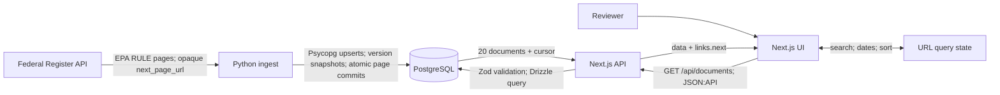
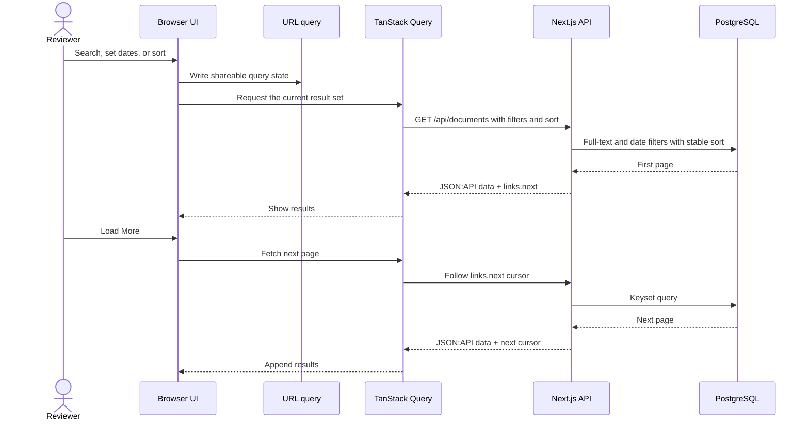

# Maiven take-home

This project ingests EPA rules from the Federal Register, stores their metadata
in PostgreSQL, and serves a read-only search library. This guide is for
reviewers and developers. Use it to run the stack, inspect the API, run ingest,
and verify the implementation. The app links to public PDFs; it does not
download document bodies.

The assessment brief allows two to three hours and expects you to explain your
decisions in a technical discussion. AI-assisted development is allowed. See
the original [assessment brief](docs/Maiven_Takehome_Assessment.pdf).

The project covers the five assessment tasks:

| Task | Implementation |
| --- | --- |
| Ingest 100 EPA rules | Targets 100 unique document numbers and follows Federal Register pagination. |
| Safe reruns | Upserts by document number, records source versions, and resumes committed checkpoints. |
| Serve documents | Provides a filtered, searchable JSON:API endpoint with 20-item cursor pages. |
| Display documents | Provides a single-page library with search, date filters, sorting, details, and **Load More**. |
| Tests and README | Covers text cleaning and PostgreSQL reruns; documents setup and more-time work here. |

## Start the reviewer stack

The Docker Compose flow builds the app and ingest images, starts PostgreSQL,
applies migrations, ingests up to 100 EPA rules, and starts the web app and
observability services.

Before you start, make sure you have:

- Docker Engine with Docker Compose
- Internet access to Docker registries and the Federal Register API
- Free local ports `3000`, `3001`, `3100`, `3200`, `4317`, `4318`, `5433`, and
  `9090`

From the repository root, run:

```sh
./scripts/bootstrap-compose.sh
```

Open [http://127.0.0.1:3000](http://127.0.0.1:3000). Confirm the API and first
page respond:

```sh
curl -fsS http://127.0.0.1:3000/api/health
curl -fsS -H 'Accept: application/vnd.api+json' \
  http://127.0.0.1:3000/api/documents
```

Use these commands to change the ingest target, run ingest again, change the
PostgreSQL host port, or stop the stack:

```sh
# Set the first-run target to 250 unique documents
./scripts/bootstrap-compose.sh --documents 250

# Run another ingest after bootstrap
./scripts/bootstrap-compose.sh ingest --max-unique-documents 100

# Use another PostgreSQL host port
env POSTGRES_PORT=5443 ./scripts/bootstrap-compose.sh

# Stop services and keep stored data
./scripts/bootstrap-compose.sh stop
```

Compose uses its own PostgreSQL database and named volumes. It does not read
`.env.local` or use the PostgreSQL service installed on your machine.

## Run with local PostgreSQL

Use this path when PostgreSQL is already installed and running. You need Node.js
24, pnpm 10.15.1, Python 3.11 or later, `uv`, PostgreSQL 17, and internet access
for ingest. `pnpm install` installs the project’s Varlock dependency.

1. Create the database if it does not exist, then create `.env.local` from the
   example if you do not already have a local configuration:

   ```sh
   psql -d postgres -c 'CREATE DATABASE "maiven-takehome";'
   cp .env.local.example .env.local
   ```

   Set `DATABASE_URL` in `.env.local` to the local PostgreSQL role that owns the
   database. For example:

   ```text
   postgresql://YOUR_LOCAL_ROLE@127.0.0.1:5432/maiven-takehome
   ```

   Replace `YOUR_LOCAL_ROLE` with your PostgreSQL role. Skip database creation
   if the database already exists. Keep an existing `.env.local`; do not
   overwrite it. Varlock validates `DATABASE_URL` against `.env.schema` and
   loads the value from `.env.local`.

2. Install dependencies, apply migrations, and install the ingest environment:

   ```sh
   pnpm install
   pnpm db:migrate
   uv sync --project pipelines/ingest
   ```

3. If the database has no documents, ingest the assessment data:

   ```sh
   ./scripts/ingest.sh --max-unique-documents 100
   ```

4. Start the web app and API:

   ```sh
   pnpm --filter @maiven/web dev
   ```

   Open [http://localhost:3000](http://localhost:3000). If no OpenTelemetry
   Collector is running, remove or unset `OTEL_EXPORTER_OTLP_ENDPOINT` in
   `.env.local`.

The database package at `packages/db` owns the Drizzle schema, migrations, and
typed client. Generate a migration after you change
`packages/db/src/schema.ts`:

```sh
pnpm db:generate
pnpm db:migrate
```

## Use the web app and API

The web app is read-only. Search by title and abstract, filter publication dates
with the 7-day and 30-day shortcuts or explicit bounds, and sort the results.
`nuqs` keeps search, date, and sort state in the URL. TanStack Query loads
pages, and **Load More** follows the API’s next link. Selecting a row opens its
detail panel; the PDF action prefers the public inspection PDF, then the public
PDF.

`GET /api/documents` returns JSON:API 1.1 with media type
`application/vnd.api+json`. The endpoint accepts these query parameters:

| Parameter | Meaning |
| --- | --- |
| `filter[q]` | Full-text search across title and abstract; maximum 200 characters. |
| `filter[publication_date][gte]` | Inclusive start date in `YYYY-MM-DD` format. |
| `filter[publication_date][lte]` | Inclusive end date in `YYYY-MM-DD` format. |
| `sort` | `publication_date`, `document_number`, `title`, `type`, or `agency`. Prefix with `-` for descending. Default: `-publication_date`. |
| `page[size]` | One to 20 documents; default: 20. |
| `page[cursor]` | Opaque cursor from the prior response’s `links.next`. |

For example, this request searches for water rules published on or after
January 1, 2026, newest first:

```sh
curl -G -H 'Accept: application/vnd.api+json' \
  --data-urlencode 'filter[q]=water' \
  --data-urlencode 'filter[publication_date][gte]=2026-01-01' \
  --data-urlencode 'sort=-publication_date' \
  --data-urlencode 'page[size]=20' \
  http://127.0.0.1:3000/api/documents
```

The response contains a `data` array and, when more results exist, a
`links.next` URL. Follow that URL without editing its cursor. The API validates
filters and sort fields, applies inclusive date bounds, and uses keyset
pagination with a stable document-number tie-break.

## Run the ingest pipeline

The pipeline fetches EPA `RULE` documents, normalizes their metadata, and stores
them in PostgreSQL. It follows the Federal Register’s opaque `next_page_url`
until it reaches the unique-document target or the source ends; it does not rely
on the source’s `count` or `total_pages` fields.

The local command is:

```sh
./scripts/ingest.sh [--max-unique-documents N] [--per-page N] \
  [--publication-date-gte YYYY-MM-DD] [--publication-date-lte YYYY-MM-DD] \
  [--new-run]
```

| Option | Behavior |
| --- | --- |
| `--max-unique-documents N` | Unique `document_number` target. Default: `100`. |
| `--per-page N` | Federal Register page size from 1 to 1,000. Default: `100`. |
| `--publication-date-gte DATE` | Include documents published on or after `DATE`. |
| `--publication-date-lte DATE` | Include documents published on or before `DATE`. |
| `--new-run` | Start a new run instead of resuming the latest matching incomplete run. |

The Federal Register search limit is 2,000 source records. If the pipeline
reaches that limit before its unique-document target, it reports a partial run
and exits with status `2`. Success exits `0`; other failures exit `1`. Use date
bounds for larger backfills.

Each source page is fetched, archived, validated, and normalized before
database writes begin. One PostgreSQL transaction upserts documents, stores
source versions and run outcomes, and advances the checkpoint. The document
number is the stable identity. A matching incomplete run resumes from its last
committed page. A query mismatch requires a new run. A PostgreSQL advisory lock
allows one ingest writer at a time.

The pipeline archives source responses under
`data/raw/federalregister/run_id=RUN_ID/` and writes structured diagnostics to
`logs/ingest.jsonl`. Compose stores both in named volumes. Ingest stores
metadata and PDF links; it does not download HTML or PDF bodies. Existing rows
gain version history when later ingests observe source changes. The
`updated_count` tracks upserts to existing rows, whether or not a field changed.

## Understand the design

This diagram shows the main data path:



Search and pagination use the same API path. **Load More** follows the returned
cursor and appends the next page:



Key implementation decisions:

- PostgreSQL is the shared contract. Drizzle owns the schema and migrations;
  parameterized Psycopg statements write ingest data.
- Ingest commits each page atomically and uses a source-payload hash to record
  document versions. A single advisory lock serializes writers.
- The API uses Zod validation, JSON:API responses, and keyset pagination. The
  search query matches a PostgreSQL GIN index over title and abstract.
- Search uses PostgreSQL full-text search with the English text configuration.
  The query schema accepts only the documented filters and sort fields.
- The first slice stores metadata and public document links. It does not store
  rule text or download PDFs.

The following paths are useful starting points when reviewing the code:

| Area | Main paths |
| --- | --- |
| Web interface | `apps/web/components/document-library/` |
| Documents API | `apps/web/app/api/documents/route.ts`; `apps/web/lib/documents/` |
| Web instrumentation | `apps/web/instrumentation.ts`; `apps/web/lib/server/` |
| Database schema and migrations | `packages/db/src/schema.ts`; `packages/db/drizzle/` |
| Ingest command and workflow | `pipelines/ingest/src/maiven_ingest/cli.py`; `pipelines/ingest/src/maiven_ingest/workflow.py` |
| Ingest client and normalization | `pipelines/ingest/src/maiven_ingest/federal_register/client.py`; `pipelines/ingest/src/maiven_ingest/document_contract.py` |
| Ingest persistence and archives | `pipelines/ingest/src/maiven_ingest/db.py`; `pipelines/ingest/src/maiven_ingest/archive.py`; `pipelines/ingest/src/maiven_ingest/diagnostics.py` |
| Telemetry stack | `ops/telemetry/`; `docker-compose.yaml` |

## Inspect telemetry

Compose starts an OpenTelemetry Collector, Grafana, Loki, Tempo, and Prometheus.
The web app sends traces to Tempo, metrics to Prometheus, and error-level Pino
logs to Loki through the Collector. Pino also writes web logs to stdout. The
ingest pipeline writes JSONL diagnostics to `logs/ingest.jsonl`; it does not
export OpenTelemetry traces.

Open Grafana at [http://127.0.0.1:3001](http://127.0.0.1:3001). On first
launch, sign in with `admin` / `admin`. Grafana has Prometheus, Loki, and Tempo
data sources provisioned. Compose exposes the Collector’s OTLP/gRPC endpoint on
port `4317` and OTLP/HTTP endpoint on port `4318`. For a host-run web app, set
`OTEL_EXPORTER_OTLP_ENDPOINT=http://127.0.0.1:4318` in `.env.local` while the
Compose Collector is running.

## Run checks

Run the web checks from the repository root:

```sh
pnpm --filter @maiven/web typecheck
pnpm --filter @maiven/web test
pnpm --filter @maiven/web test:coverage
pnpm --filter @maiven/web build
```

Run the ingest tests with the development dependencies:

```sh
uv sync --project pipelines/ingest --extra dev
uv run --project pipelines/ingest --extra dev pytest pipelines/ingest/tests
```

The ingest suite covers text cleaning, Federal Register requests and paging,
retries, normalization, and workflow outcomes. Its PostgreSQL integration test
covers upserts, version links, resume, locking, and atomic page commits. That
test runs only when `INGEST_TEST_DATABASE_URL` points to a migrated, disposable
database whose name contains `test`; otherwise pytest skips it. The integration
test writes rows and run history, so do not point it at the reviewer or
development database.

To prepare an isolated local test database, run:

```sh
psql -d postgres -c 'CREATE DATABASE "maiven-takehome-test";'
env DATABASE_URL=postgresql://YOUR_LOCAL_ROLE@127.0.0.1:5432/maiven-takehome-test pnpm db:migrate
env INGEST_TEST_DATABASE_URL=postgresql://YOUR_LOCAL_ROLE@127.0.0.1:5432/maiven-takehome-test \
  uv run --project pipelines/ingest --extra dev pytest pipelines/ingest/tests
```

Replace `YOUR_LOCAL_ROLE` with the role that owns the test database. After the
test run, drop the disposable database if you no longer need it. If the test
database already exists, skip the `CREATE DATABASE` command.

## More time

### Product

- Ingest and version full rule text, then add semantic search over document
  content.
- Let companies describe their industry, locations, operations, substances,
  and concerns. Rank rules against that profile and explain each match with
  cited passages.
- Add saved rules, alerts for new or amended matches, relevance feedback,
  version comparisons, and team ownership.

### Workflow polish

- Persist the loaded cursor chain so refresh restores all loaded pages and
  **Load More** continues from the same position.
- Replace repeated newest-page fetches with incremental update windows. Skip
  unchanged writes by comparing version hashes.
- Surface ingest freshness, partial runs, and the latest failure in the UI.

## Submit the assessment

The brief asks you to send a ZIP of the code to `jess@wearekusudi.org` and,
ideally, grant GitHub access to `joshjbayne@gmail.com`. Be ready to explain the
upsert identity, source pagination, retries, API cursor, and trade-offs in the
technical discussion.
