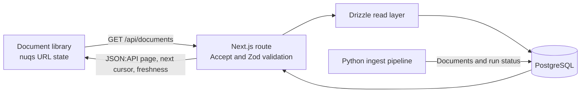

# Maiven web

The web app is a read-only library for U.S. Environmental Protection Agency
rules published in the Federal Register. Use this guide to start the app,
check its API, and follow a request through the code. The Python ingest
pipeline writes the source data separately; see the [ingest README](../../pipelines/ingest/README.md).

## Before you begin

- Node.js 24 and pnpm 10.15.1.
- A running PostgreSQL 17 service and a `maiven-takehome` database.
- Database migrations applied and EPA documents loaded.

Use the existing local PostgreSQL service for development. See [database setup](../../docs/database.md) to create the database and configure `DATABASE_URL`. Docker Compose Postgres is optional and uses port 5433 by default.

## Start the app

Run these commands from the repository root.

1. Create the local environment file:

   ```sh
   cp .env.local.example .env.local
   ```

   Set `DATABASE_URL` to the local role and `maiven-takehome` database. Varlock loads this file with the root `.env.schema`.

   The example also sets `OTEL_EXPORTER_OTLP_ENDPOINT`. Leave it set only when the local telemetry stack is running; clear it to run without telemetry.

2. Install dependencies and apply database migrations:

   ```sh
   pnpm install
   pnpm db:migrate
   ```

3. Start the development server:

   ```sh
   pnpm --filter @maiven/web dev
   ```

   Open `http://localhost:3000`. Next.js prints a different URL if port 3000 is busy.

## Verify the app

Open the library, then request a JSON:API page and the health endpoint:

```sh
curl -H 'Accept: application/vnd.api+json' \
  'http://localhost:3000/api/documents'
curl 'http://localhost:3000/api/health'
```

The documents response contains a `data` array, a `links.next` cursor when more results exist, and ingest freshness metadata. The health endpoint returns `{"status":"ok"}`.

## Run checks

The web package provides type checking, Node.js tests, coverage, and a production build:

```sh
pnpm --filter @maiven/web typecheck
pnpm --filter @maiven/web test
pnpm --filter @maiven/web test:coverage
pnpm --filter @maiven/web build
```

## Search and URL state

The browser keeps search text, publication dates, and sorting in the URL. It offers 7-day and 30-day date shortcuts, custom date bounds, sortable result columns, and a detail panel with public Federal Register links. The PDF action prefers the public inspection PDF URI and falls back to the public PDF URI.

`GET /api/documents` returns JSON:API 1.1 with the `application/vnd.api+json` media type. It accepts that media type, `application/*`, or `*/*` in the `Accept` header. Search uses PostgreSQL English full-text search across titles and abstracts. Publication date bounds are inclusive. The supported query parameters are:

| Parameter | Meaning |
| --- | --- |
| `filter[q]` | Full-text search; at most 200 characters. |
| `filter[publication_date][gte]` | Inclusive publication start date in `YYYY-MM-DD` format. |
| `filter[publication_date][lte]` | Inclusive publication end date in `YYYY-MM-DD` format. |
| `sort` | `publication_date`, `document_number`, `title`, `type`, or `agency`. Prefix a field with `-` for descending order. Defaults to `-publication_date`. |
| `page[size]` | Page size from 1 to 20; defaults to 20. |
| `page[cursor]` | Opaque cursor from the previous response's `links.next`. |

For example, this request searches for “water,” limits results to a date range, and sorts newest first:

```text
/api/documents?filter[q]=water&filter[publication_date][gte]=2026-01-01&sort=-publication_date&page[size]=20
```

The API validates query parameters with Zod, reads documents through Drizzle, and returns JSON:API 1.1. TanStack Query follows `links.next` when you select **Load More**. See the [documents API reference](../../README.md#documents-api) for response negotiation and error details.

## Follow a request

The browser sends the URL-backed query to the Next.js route. The route validates it, reads a page and ingest freshness from PostgreSQL, then returns JSON:API. The browser appends later pages by following the returned cursor. The separate ingest pipeline writes documents and run status to the same database.



## Find the main code paths

The following files contain the app entry points and request flow:

| File | Responsibility |
| --- | --- |
| `app/page.tsx` | Renders the document library. |
| `app/layout.tsx` | Adds the Nuqs and TanStack Query providers. |
| `components/document-library/provider.tsx` | Owns URL state and infinite pagination. |
| `components/document-library/data.ts` | Builds API URLs, fetches pages, and validates responses. |
| `components/document-library/filters.tsx` | Renders search and publication-date controls. |
| `components/document-library/results.tsx` | Renders sortable results and load-more state. |
| `components/document-library/detail-panel.tsx` | Renders selected document details and source links. |
| `app/api/documents/route.ts` | Validates requests, reads documents, and builds API responses. |
| `lib/documents/query.ts` | Defines query schemas, parsing, and cursor encoding. |
| `lib/documents/read.ts` | Runs full-text search, filters, sorting, cursor pagination, and freshness reads. |
| `lib/documents/schemas.ts` | Defines API response schemas. |
| `instrumentation.ts` | Registers OpenTelemetry when an OTLP endpoint is configured. |

For local traces, metrics, and logs, see [local telemetry setup](../../README.md#local-telemetry).
