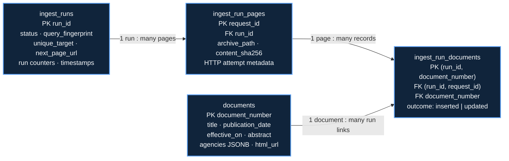
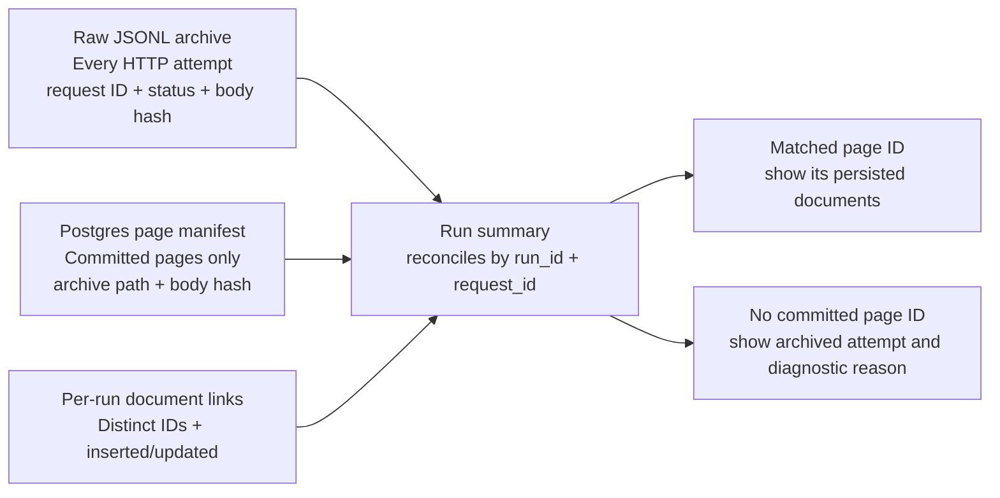

# Maiven takehome plan

- **Status:** database, ingest, read API, and listing UI implemented and verified against local PostgreSQL
- **Updated:** 2026-09-25
- **Time box:** 2–3 hours, matching the candidate brief

## Goal

Show one clear path from the Federal Register to a searchable page. Keep the work small enough to explain in a technical discussion. The brief values approach and core capability over production polish.

## Acceptance checklist

- [x] Each ingest run upserts up to its configurable unique-document target (100 by default), or stops at source exhaustion or the 2,000-source-record ceiling (`partial`); existing database rows remain across runs.
- [x] Restarting an incomplete run resumes its last committed source checkpoint without skipping or duplicating documents.
- [x] Pagination does not rely on `count` or `total_pages`.
- [x] Re-running the ingest does not duplicate documents or delete existing rows.
- [x] Every fetched response has a run/request trace and SHA-256 of the archived bytes in the separate raw JSONL archive. Responses over the configured size cap (32 MiB by default) store a bounded prefix, mark it incomplete, and fail the attempt.
- [x] `GET /api/documents` returns a read-only JSON:API 1.1 collection with English full-text search across title/abstract, inclusive publication-date filters, and allowlisted sorting.
- [x] The API returns up to 20 documents per page with stable, sort-aware cursors, JSON:API `self`/`next` links, consistent `meta`, and errors without `data`.
- [x] One responsive page displays documents, search, custom/7-day/30-day publication filters, sortable columns, public PDF links, and Load more.
- [x] Tests cover text cleaning and ingest re-run behavior.
- [x] README explains requirements, setup, how to run, and what more time would change.

These boxes track implemented acceptance. Automated and manual verification coverage, including remaining gaps, is recorded in the latest `docs/devlog.md` entry.

## Deliverable invariants

1. `document_number` is the stable source identity and has a unique database constraint.
2. Ingest writes use an upsert inside a transaction; never clear the table before loading. A later run may update a known document without removing other rows.
3. Archive every received HTTP response before transforming it. Include run/request provenance and a SHA-256 hash of the archived bytes. Preserve complete bodies up to the configured size limit (32 MiB by default); for larger responses, keep the bounded prefix, mark it incomplete, and fail the attempt. Normalize serving fields into Postgres and never overwrite an older archive.
4. Each run stops after its configured number of distinct `document_number`s (100 by default), source exhaustion, or the 2,000-source-record ceiling. The ceiling produces a `partial` run if the unique target has not been reached. `per_page=100` is the independent request page size; duplicates do not count toward the run target. `count` and `total_pages` are informational only.
5. The serving API defaults to `publication_date DESC` so latest rules appear first; explicit `sort=field` is ascending and `sort=-field` is descending. Every sort adds `document_number DESC` as a deterministic tie-breaker. A changed query filter or sort starts pagination over.
6. Network failures and malformed responses are visible as failed runs. Do not log and skip them as if ingest succeeded.
7. Runtime diagnostics are append-only JSONL files under root `logs/`, ignored by Git. Keep source bodies out of diagnostics; use run/request IDs to connect events to the separate raw response archive.

## Proposed shape

```text
Federal Register API
        │ one sequential page request at a time
        ▼
Python CLI ── raw HTTP response ──> run-scoped JSONL archive
    │ clean + normalize
    └── psycopg parameterized SQL ──> PostgreSQL documents + run/checkpoint state
                                          │
                             Next.js App Router + Drizzle
                             JSON:API GET (20 + cursor link)
                                          │
                                          ▼
                             list + filters + Load more

Python Loguru ──> logs/ingest.jsonl       Pino ──> logs/web.jsonl
                         (append-only, gitignored)
```

The `documents` table represents all 56 source document properties listed by the OpenAPI `DocumentField` enum, not only the fields selected by the assignment's sample query. Store scalar metadata as typed columns and arrays/variable nested objects as JSONB; retain `agencies` as an array of source agency objects without a separate agency catalog. Keep `updated_at` for local upsert tracking. Include `ingest_runs`, `ingest_run_pages`, and `ingest_run_documents` in the baseline to enforce the 100-unique-document run target, resume from a checkpoint, and trace archive pages to records. Do not add a general job engine.

Append one record per received HTTP response to `data/raw/federalregister/run_id=<id>/responses.jsonl`. Each record includes `run_id`, a unique `request_id`, page and attempt numbers, fetch time, method and requested URL, HTTP status, selected response headers (including the upstream `x-request-id` when present), `content_sha256`, and archived body bytes. The default body limit is 32 MiB and can be changed with `FEDERAL_REGISTER_MAX_RESPONSE_BYTES`. For larger responses, the client stores a bounded prefix, marks `body_complete` false, hashes the archived prefix, and fails the attempt before decoding or normalization. For complete bodies, store UTF-8 text when strict decoding succeeds; otherwise store the exact bytes as base64 with an explicit `body_encoding`, so malformed UTF-8 remains losslessly archived and the hash can be re-verified. Archive successful and unsuccessful HTTP responses before status classification or retry so a failed run can be inspected. A transport failure without an HTTP response goes in the run's `transport_failures.jsonl`. Keep these source-evidence files separate from `logs/`.

### Ingest model schemas and data flow

Keep upstream DTOs, archived evidence, normalized rows, and run bookkeeping as distinct models. Validate only the source fields the workflow needs; within the response-size limit, the JSONL archive retains the full response body, including fields outside these models. Oversized responses retain a bounded prefix and fail before parsing.

```text
DocumentSearch = {
  agencies: string[], document_types: string[], order: "newest",
  per_page: integer, publication_date?: { gte?: date, lte?: date }, fields?: string[]
}

FederalRegisterPage = {
  count?: integer, total_pages?: integer, next_page_url?: URL | null,
  results: FederalRegisterDocument[]
}

Agency = source agency object (retained in the raw response and the document's JSONB array)

FederalRegisterDocument = {
  abstract, action, agencies, agency_names, amendatory_instructions,
  body_html_url, cfr_references, cfr_topics, citation, comment_url,
  comments_close_on, correction_of, corrections, dates, disposition_notes,
  docket_id, docket_ids, dockets, document_number, effective_on, end_page,
  excerpts, executive_order_notes, executive_order_number, explanation,
  full_text_xml_url, html_url, images, images_metadata, json_url, mods_url,
  not_received_for_publication, page_length, page_views, pdf_url, president,
  presidential_document_number, proclamation_number, public_inspection_pdf_url,
  publication_date, raw_text_url, regulation_id_number_info,
  regulation_id_numbers, regulations_dot_gov_info, regulations_dot_gov_url,
  related_documents, significant, signing_date, start_page, subtype, title,
  toc_doc, toc_subject, topics, type, volume
}

ArchivedResponse = {
  run_id: UUID, request_id: UUID, page_number: integer, attempt: integer,
  fetched_at: timestamp, request: { method: "GET", url: URL },
  response: { status: integer, upstream_request_id?: string, headers: object },
  content_sha256: string, body_encoding: "utf-8" | "base64", body: string
}

Document = all FederalRegisterDocument properties persisted as database columns,
           with source-optional properties nullable and nested values stored as jsonb;
           plus updated_at: timestamp
```

The ingest and resume flow persists this small graph in Postgres:

```text
ingest_runs(
  run_id UUID PK, status, query_fingerprint, unique_target, next_page_url,
  pages_fetched, unique_documents_seen, inserted_count, updated_count,
  retries, failure_class, started_at, finished_at
)
ingest_run_pages(
  request_id UUID PK, run_id FK, page_number, fetched_at, http_status,
  upstream_request_id NULL, archive_path, content_sha256,
  UNIQUE(run_id, request_id)
)
ingest_run_documents(
  run_id FK, request_id, document_number FK -> documents, outcome (inserted|updated),
  PK(run_id, document_number), FK(run_id, request_id) -> ingest_run_pages
)
documents(document_number PK, normalized serving fields...)
```



Think of the raw JSONL archive as the attempt record: it says what the script requested and preserves each response body up to the 32 MiB limit. Larger responses retain a hashed prefix and are marked incomplete. Postgres is the commit record: it says which response page made it through validation and its database transaction, and which distinct documents that run counted. The run summary reconciles the two using `(run_id, request_id)`. That gives one readable account of committed work and archived attempts that did not commit.



Every archive line stays in the report, including retries. A matching `ingest_run_pages` row marks that attempt as committed; joining through `ingest_run_documents` shows the document IDs and upsert outcomes counted toward the run target. An archive line without a page-manifest match records an attempt whose transaction did not commit, such as a failed response or interrupted write. A committed page may also contain duplicate or over-target source objects: those remain in the archived body but have no per-run document link. Oversized failed responses retain only their bounded prefix. Diagnostics supply the failure class and correlation details; source bytes stay in the run archive.

### Resumable page transaction

Persist a run's status (`running`, `failed`, `succeeded`, or `partial`), immutable query fingerprint, configurable `unique_target` (100 by default), counters, failure class, and `next_page_url` checkpoint in `ingest_runs`. The checkpoint is the URL to fetch next; initialize it with the first request URL. After a page is archived, validated, and normalized, use one Postgres transaction to upsert only distinct source IDs not already counted in this run, write its `ingest_run_pages` row and `ingest_run_documents` outcome rows, and update counters/checkpoint/status. The `(run_id, document_number)` key enforces run-wide deduplication. Mark the run `succeeded` when `unique_target` unique IDs have been linked, even if the page has more results. If the API has no next link first, mark the run `succeeded` with however many unique documents were available. If the 2,000-source-record ceiling is reached before the target, mark the run `partial`. Otherwise, set the checkpoint to the API-provided `next_page_url`. Preserve complete fetched responses up to the configured size limit (32 MiB by default), including duplicate or over-target records and the returned next link; oversized responses retain a bounded prefix and fail before parsing. Never derive a cursor from `count` or `total_pages`.

Fetch one page at a time, following the API's cursor chain in order. On restart, resume the latest incomplete run with the same query fingerprint by default; an explicit `--new-run` starts a separate run. If an incomplete run exists with a different fingerprint, stop and require `--new-run` rather than silently starting another run. If the process fails before the page transaction commits, the checkpoint still points to that page; resume refetches it, and the unique-key upsert prevents duplicates. If commit succeeds, page records, counts, manifest, and the next checkpoint or terminal status are durable together. A resume must match the original query fingerprint, including filters, `per_page`, and unique target. Archive append is intentionally outside the DB transaction: an interrupted page may leave an extra archived attempt, but it cannot advance the checkpoint or skip persistence. Acquire one global, session-level Postgres advisory lock before run setup and hold it through the final summary. It fails fast when another writer holds it, preventing concurrent runners from racing on run selection, page checkpoints, counters, or manifests. The global lock also serializes distinct query/date ranges; this is acceptable while ingestion is sequential. PostgreSQL releases the lock when its connection closes, so a stale `running` run can resume from its last committed checkpoint. A completed run stays complete; a later fresh run may upsert the same source IDs, and the documents table is never truncated or limited to 100 rows.

```mermaid
sequenceDiagram
    participant FR as Federal Register
    participant CLI as Ingest CLI
    participant Archive as Raw JSONL archive
    participant Model as Validate + normalize
    participant PG as Postgres
    CLI->>PG: Acquire global session advisory lock
    CLI->>PG: Create/resume run
    CLI->>FR: GET checkpoint URL (sequential)
    FR-->>CLI: Response + next_page_url
    CLI->>Archive: Append body, request metadata, SHA-256
    CLI->>Model: Validate envelope; normalize unseen document numbers
    Model-->>CLI: Rows + API next_page_url
    CLI->>PG: Transaction: upsert docs + page/document links + checkpoint/status
    alt Commit succeeds
        PG-->>CLI: Commit page and checkpoint/status together
        CLI->>FR: Fetch next URL if target not met and checkpoint is non-null
    else Process/DB failure before commit
        PG-->>CLI: Roll back; checkpoint remains on this page
        Note over CLI,PG: Resume refetches this page; document_number upserts remain idempotent
    end
```

Write structured events to `logs/ingest.jsonl` and `logs/web.jsonl`. Each line gets a timestamp, level, service, event name, and `run_id` or `request_id`, plus the relevant page, status, duration, count, retry delay, or error class. Never log the full source payload; the raw response archive owns that detail. Ignore `logs/` in Git; keep `data/raw/` as a separate archive path whose persistence/retention is an explicit project choice.

### Repo shape

```text
apps/web/
  package.json              depends on @maiven/db and Drizzle ORM query operators
  src/                      Next.js App Router: API and page
packages/db/
  package.json              Drizzle ORM/Kit and PostgreSQL dependencies
  src/client.ts             typed PostgreSQL client factory
  src/schema.ts             shared schema for all source properties and run state
  drizzle.config.ts         PostgreSQL schema and migration paths
  drizzle/                  committed SQL migrations and Drizzle snapshots
package.json                root DB scripts delegating into @maiven/db
pipelines/ingest/
  pyproject.toml           uv project; independent Python environment
  uv.lock
  spec/
    federal-register.openapi.json
  src/maiven_ingest/
    cli.py                 parse run/resume/unique-limit options; set exit status
    config.py              environment config and validation
    diagnostics.py         structured local event logging
    federal_register/
      client.py            HTTP transport, query encoding, retry, page envelope
    models.py              typed search options and response envelope
    document_contract.py   field contract, validation, serving-row normalization
    repository.py          persistence port and run/page data contracts
    postgres_repository.py PostgreSQL adapter and atomic page persistence
    workflow.py            page traversal, resume checkpoint, and orchestration
    archive.py             append raw HTTP responses to run-scoped JSONL
  tests/
    fixtures/
    test_client.py
    test_archive_normalize.py
    test_postgres_repository.py
    test_postgres_repository_lock.py
    test_workflow.py
docker-compose.yaml       optional reviewer PostgreSQL service
data/raw/                 run-scoped JSONL Federal Register response archive
logs/                     local JSONL diagnostics; ignored by Git
docs/                     plan, append-only devlog, assignment brief, README links
```

Keep the two toolchains independent. `packages/db` owns the PostgreSQL schema, Drizzle Kit config, migration history, and typed TypeScript client. Generate and apply reviewed SQL migrations there before ingesting. The Python CLI uses the same columns through parameterized Psycopg SQL; it does not own schema changes. Use a reviewed custom migration if a database feature cannot be expressed cleanly in Drizzle. Skip Turborepo or a cross-language task runner unless setup proves it necessary.

### Parallel work boundaries

The database contract is implemented and is the shared seam. Keep `packages/db/src/schema.ts` and its migrations frozen while ingest and web work proceed; send any evidenced schema gap to the integrator for review. Ingest owns `pipelines/ingest/**` and writes to the tables described above. Web owns `apps/web/**` and reads `documents` through `@maiven/db`; it implements only the documented read-only JSON:API collection and page. The two tasks can proceed in parallel because their implementation files do not overlap.

The integrator owns root workspace changes, `pnpm-lock.yaml`, shared environment/run commands, documentation integration, migration changes, and the final cross-app verification. Workers should report dependency or schema needs instead of editing those shared files. Ingest loads the root Varlock environment so it receives the same `DATABASE_URL` as the DB commands; add its canonical root run command during scaffold integration. The web scaffold may be created as part of the web task; no existing app source is assumed.

Keep the HTTP client generic for the Federal Register document-search endpoint, with a small EPA Rules query preset above it. The client owns URL/parameter construction, the reusable HTTP session, timeout/retry policy, status classification, response-envelope validation, and following a same-origin `next_page_url`. The EPA preset owns agency/type/date/order/field filters and defaults each request to `per_page=100`. The workflow owns the separate 100-unique-document run target, cursor traversal until target, source exhaustion, or the 2,000-source-record ceiling, run-wide deduplication, archive-before-transform order, and persistence. Do not generate a broad SDK for all API paths: the OpenAPI spec leaves success response bodies undefined.

Use a synchronous `httpx.Client` for the first version and keep page requests sequential. Its client-level configuration supports a reusable base URL, headers, connection pooling, and timeouts; retry behavior for `429`/`5xx` and `Retry-After` remains our explicit client policy. [HTTPX clients](https://www.python-httpx.org/advanced/clients/) and [timeouts](https://www.python-httpx.org/advanced/timeouts/) document those controls. The public API has no key requirement; the OpenAPI file lists no authentication scheme.

### Federal Register API overview

The checked-in [OpenAPI snapshot](../pipelines/ingest/spec/federal-register.openapi.json) is OpenAPI 3.0.0, served relative to `/api/v1/`. Its paths are all `GET` operations:

| Area | Paths |
| --- | --- |
| Published documents | `/documents.{format}`, `/documents/{document_number}.{format}`, `/documents/{document_numbers}.{format}`, `/documents/facets/{facet}`, `/issues/{publication_date}.{format}` |
| Public inspection documents | `/public-inspection-documents.{format}`, `/public-inspection-documents/current.{format}`, `/public-inspection-documents/{document_number}.{format}`, `/public-inspection-documents/{document_numbers}.{format}` |
| Reference data | `/agencies`, `/agencies/{slug}`, `/images/{identifier}`, `/suggested_searches`, `/suggested_searches/{slug}` |

The useful shared schemas describe inputs/enums, not document response models: `Format`, `DocumentField`, `DocumentType`, `Agency`, `FrDate`, `FrYear`, `Facet`, `Section`, `Topic`, `President`, `PresidentialDocumentType`, `PublicInspectionDocumentField`, and `SuggestedSearch`. The EPA slug is `environmental-protection-agency`; the document type value is `RULE`. The schema includes date ranges, full-text search, agency/type lists, `per_page` (documented 1–1000, default 20), `page`, `order`, and optional `fields[]`. It also describes effective-date, docket, RIN, section/topic, CFR, significance, and location filters. Every successful operation declares only “200 Success”, with no response schema.

The in-scope search request is `GET /api/v1/documents.json` with `conditions[agencies][]=environmental-protection-agency`, `conditions[type][]=RULE`, `order=newest`, and `per_page=100` by default. Optional publication-date bounds and repeated `fields[]` values map directly to the documented parameters. Request all 56 `DocumentField` enum values so normalized rows are not limited to the assignment sample projection; archive each returned object unchanged before normalization.

Keep three config boundaries separate:

| Config | Options |
| --- | --- |
| `FederalRegisterClientConfig` | Base URL, connect/read timeout, default headers/User-Agent, retry budget, backoff bounds. No API-key option. |
| `DocumentSearch` | Agency slugs, document types, optional term/date bounds, order, `per_page` (EPA preset defaults to 100; schema allows 1–1000), optional field projection. Serialize arrays as repeated bracketed keys. |
| `IngestRunConfig` | Configurable `max_unique_documents` (default 100; positive integer; CLI option `--max-unique-documents`); `per_page=100` independently; one in-flight request. Resume the latest incomplete run with a matching query fingerprint by default; a mismatch requires `--new-run`. |

The live response envelope observed for this query is `{ description, count, total_pages, next_page_url, results }`. Each result has a `document_number`, title/type, publication date, links, agencies as objects, and optional nullable `abstract`/`excerpts`. `next_page_url` is an API-provided URL with the query retained and an opaque `search_after_cursor`; use it verbatim after checking the origin. Do not construct the cursor or decide completion from `count`/`total_pages`.

The probe found a page-size inconsistency: `per_page=2` returned two rows, while `per_page=1` returned twenty rows despite the schema's minimum of one. The EPA Rules profile defaults to requesting 100 rows per upstream page, with a separate run target of 100 unique `document_number`s. Process the response in source order, skip duplicate IDs, and persist only through the remaining run allowance. Archive complete responses up to the configured size limit (32 MiB by default); larger responses retain a bounded prefix and fail. Continue through `next_page_url` when duplicates leave the run below target. Keep a fixture for the `per_page=1` anomaly. The API guide also limits pagination to the first 2,000 results for a search, so use date filters to cover wider windows. Two sampled responses had no rate-limit headers; one returned `x-request-id`. The API guide does not publish a request quota, so keep one in-flight request and treat `429`/`Retry-After` handling as polite client behavior, not a published service requirement.

## Decisions and assumptions

| Topic | Plan | Reason / follow-up |
| --- | --- | --- |
| “A run should ingest 100 documents” | Target 100 distinct source `document_number`s per run by default, subject to source exhaustion and the 2,000-source-record ceiling. Configure another positive limit for tests or other runs. Existing database records count toward that run target when encountered; this is not a lifetime table cap or a target of 100 new inserts. | README assumption: “Each run ingests up to 100 distinct Federal Register documents by default. Set `--max-unique-documents` to change the per-run target. If a run is interrupted, rerunning resumes its checkpoint. New runs upsert matching rows and retain all other database records.” |
| Source pagination | Request `per_page=100` by default, separately enforce the configured unique-document run target (100 by default), and follow `next_page_url` in order until the target, source exhaustion, or 2,000 source records. | API response links carry an opaque `search_after_cursor`; do not synthesize cursor values. Ignore `count` and `total_pages`. Duplicates do not count toward the target. Keep the `per_page=1` anomaly in a client fixture. |
| Resume after interruption | A normal restart resumes the latest incomplete run when the query fingerprint matches; a mismatch requires `--new-run`. | Checkpoint advancement commits with page upserts and the page manifest. Resume refetches an uncommitted page; stable source IDs and `(run_id, document_number)` prevent duplicate persistence. The configured per-run target is part of the fingerprint. |
| Ingest persistence boundary | Keep the workflow dependent on the `IngestRepository` protocol and run/page data contracts; implement PostgreSQL SQL in `PostgresIngestRepository`. | The workflow owns HTTP-page orchestration and evidence; the adapter owns SQL and atomic page persistence. This keeps database access replaceable at the boundary without spreading SQL through workflow code. |
| Single-writer coordination | Acquire one global, session-level PostgreSQL advisory lock before run setup; hold it through the final summary and release it afterward. | PostgreSQL already coordinates runners that share the ingest database, so no separate lock service or lock table is needed. The SQL cursor only issues the request; the PostgreSQL session owns the lock, which survives page commits. Trade-offs: a run holds one database connection; the global key serializes different query/date ranges; advisory locks only coordinate writers that acquire the same key. PostgreSQL releases the lock when the connection closes. |
| Do we need an extra upstream page? | No. Stop at the configured target (100 by default), source exhaustion, or the 2,000-source-record ceiling. | The API provides the continuation link. Do not add a confirmation request or rely on totals; mark the run `partial` if the source ceiling comes first. |
| Raw source archive | Append every received HTTP response to `data/raw/federalregister/run_id=<id>/responses.jsonl` before status classification, retry, or normalization. Each line includes run/request IDs, page/attempt, fetch time, method/URL, status, selected response headers (including upstream request ID when present), SHA-256 of archived bytes, and the body. The configured limit defaults to 32 MiB; larger responses store a hashed prefix, mark it incomplete, and fail the attempt. | Preserves response evidence for replay and diagnosis if parsing, normalization, or the DB write fails. Postgres page/record links associate successful archived responses with persisted document IDs/outcomes. This is separate from gitignored diagnostic JSONL under `logs/`; no PyArrow dependency is needed. |
| Run evidence boundary | Keep response archives and transport failures in the run's `data/raw/federalregister/run_id=<id>/` directory. Build attempts from per-run evidence plus the PostgreSQL run report; keep `logs/ingest.jsonl` diagnostic only. | Summaries must survive log rotation, missing log files, or logging format changes. One `AttemptRecorder` port lets the HTTP client record both response and transport-failure evidence. |
| Latest state and metadata versions | `documents` is the latest-state projection; every mapped source field replaces its prior value, including `null` and omitted optional fields normalized to `null`. Preserve the original source JSON shape in `document_versions`; link each committed run/document to its source hash. | Consumers distinguish cleared/null values in the latest row from omitted-vs-explicit-null shape in the snapshot. Live runs verified initial snapshots and run links for 2,100 documents, but no repeated source document; a controlled PostgreSQL integration case checks a changed payload creates and links a new version. |
| Runtime logs | Use Loguru in Python and Pino in the Next.js server for JSONL append sinks at `logs/ingest.jsonl` and `logs/web.jsonl`. Add `/logs/` to root `.gitignore`. | `pinio` interpreted as Pino. Keep human decisions in `docs/devlog.md`; logs hold machine events only. Do not log raw payloads. |
| API format | Follow JSON:API 1.1 for the supported read-only documents collection: `application/vnd.api+json`, top-level `data`, resource objects (`type: documents`, `id: document_number`, `attributes`), top-level `links.self`/`links.next`, stable `meta`, and JSON:API `errors`. | Do not return a custom `{ items, nextCursor }` envelope. This is a scoped read API; writes, relationships, `include`, and compound documents are out of scope. Keep `agencies` as an attribute. |
| Media negotiation | Return `Content-Type: application/vnd.api+json` and honor JSON:API's `Accept` media-type rules for the supported representation. | No extensions or profiles are needed. Keep negotiation small but spec-correct for the media types and parameters the endpoint supports. |
| Filters and pages | Use `filter[publication_date][gte]`, `filter[publication_date][lte]`, `filter[q]`, `page[size]`, and `page[cursor]`. Omitted `sort` defaults to `-publication_date`; explicit `sort=field` is ascending and `sort=-field` is descending. | JSON:API reserves these query parameter families. Filter meaning remains specific to this API. Enforce a maximum page size of 20 and reject unsupported `filter[...]` keys. |
| “Fetch the next 20” | Use keyset/cursor pagination and expose the next request as top-level `links.next`. Query 21 rows; set `links.next` only when row 21 exists, otherwise set it to null. | JSON:API defines pagination links and reserves the `page` parameter family; it does not prescribe cursor encoding. No `COUNT(*)` or total needed. |
| Cursor sort key | Encode the last visible value for the selected sort and `document_number` tie-breaker in `page[cursor]`. Carry filters and sort in the next link. | Each supported sort gets a deterministic keyset cursor; document number is the stable tie-breaker. |
| Text cleaning and search | Trim and collapse whitespace in title/abstract; preserve agency objects in an `agencies jsonb` array. Search title and abstract with PostgreSQL English full-text search (`websearch_to_tsquery`) and a matching GIN expression index. | Token and stem matching with an index, while keeping the search surface small. |
| JSONB agency filtering | Store agencies as a JSONB array. If agency filters become necessary, use JSONB containment (`agencies @> '[{"slug":"…"}]'::jsonb`) and measure with `EXPLAIN (ANALYZE, BUFFERS)` before adding a GIN index. | A whole-column GIN `jsonb_path_ops` index supports `@>` and fits a dynamic agency filter better than a partial index. The current EPA-only dataset is small and every row is likely to match the EPA predicate, so defer indexing. A partial index is useful only for a selective, stable subset and a query whose predicate implies the index predicate; parameterized predicates do not match at planning time. See [PostgreSQL JSONB indexing](https://www.postgresql.org/docs/current/datatype-json.html#JSON-INDEXING) and [partial indexes](https://www.postgresql.org/docs/current/indexes-partial.html). |
| Date filter | Inclusive `filter[publication_date][gte]` and `filter[publication_date][lte]` on `publication_date`; reject invalid dates or lower bound after upper bound with 400. | JSON:API query family; no timezone conversion for date-only fields. |
| Database access and migrations | Python uses `psycopg` 3 with parameterized SQL, no Python ORM. TypeScript uses Drizzle ORM/Kit for the typed schema, generated SQL migrations, and serving queries. | `packages/db/` owns the schema, typed PostgreSQL client factory, migration config/history, and dependencies; the web package consumes it and imports Drizzle query operators directly. Root pnpm scripts delegate to `@maiven/db` before Python ingest. The document table includes all 56 properties exposed in OpenAPI's `DocumentField` enum. SQLAlchemy Core is the Python query-builder analogue to Kysely; direct Psycopg SQL is leaner for this fixed ingest. See [Drizzle Kit generate](https://orm.drizzle.team/docs/drizzle-kit-generate), [Drizzle Kit migrate](https://orm.drizzle.team/docs/drizzle-kit-migrate), [SQLAlchemy Core](https://docs.sqlalchemy.org/en/20/core/), and [Psycopg parameters](https://www.psycopg.org/psycopg3/docs/basic/params.html). |
| Client behavior | Start with sequential page requests, configurable timeout and retry budget, and bounded retries for timeouts, 408, 429, and 5xx. Respect `Retry-After`; fail fast on other 4xx and invalid payload envelopes. | The API publishes no quota in its schema/guide. One in-flight request is enough for this run. Log status, latency, upstream `x-request-id` when present, retries, and terminal error class. |
| UI | Single responsive read-only list page; search, date presets/custom bounds, sorting on publication date, document number, title, type, and agency, public PDF links, and Load more. Use Tailwind, shadcn components, `nuqs` for URL state, and TanStack Query `useInfiniteQuery` for pages. | URL owns shareable filters/sort; query state owns retrieved pages. Public inspection PDF URL is preferred, with the regular public PDF URL as fallback. |
| Local database | Use the machine's local PostgreSQL for development; retain Compose as an optional reviewer shortcut. | Create `maiven-takehome` in local PostgreSQL, set Varlock's `DATABASE_URL`, and run `pnpm db:migrate`. Compose defaults to host port 5433. Keep hosting out of the critical path. See [database setup](database.md). |

### JSON:API collection shape

```text
GET /api/documents?filter[publication_date][gte]=2026-01-01&filter[publication_date][lte]=2026-09-24&filter[q]=water&sort=-publication_date&page[size]=20&page[cursor]=<opaque>
Accept: application/vnd.api+json

{
  "jsonapi": { "version": "1.1" },
  "links": { "self": "...", "next": "..." /* or null */ },
  "meta": { "request_id": "...", "page": { "size": 20, "hasMore": true } },
  "data": [
    {
      "type": "documents",
      "id": "2026-12345",
      "attributes": {
        "title": "...",
        "publication_date": "2026-09-24",
        "effective_on": null,
        "abstract": "...",
        "agencies": [],
        "html_url": "..."
      }
    }
  ]
}
```

Respond with `Content-Type: application/vnd.api+json` and handle `Accept` negotiation for the supported representation. The database query fetches 21 matches in the requested order. Return the first 20; use the extra row to decide whether `links.next` exists. The next URL carries the cursor from the final returned row, not the extra row, plus the active filters and sort. Keep the success document shape stable, including `jsonapi`, `links.self`, nullable `links.next`, `meta.request_id`, `meta.page.size`, and `meta.page.hasMore`. Return invalid-parameter failures with top-level `jsonapi`, `meta.request_id`, and JSON:API `errors` containing `status`, `title`, `detail`, and `source.parameter`, with no `data` member. Keep the API spec-shaped within its read-only scope; do not claim support for unimplemented JSON:API operations.

## Execution plan

| Stage | Time | Work | Exit check |
| --- | ---: | --- | --- |
| 0. API contract | 10 min | Complete: save the OpenAPI snapshot, review endpoint/query schemas, and probe EPA Rules with a small page. Record that response bodies are undocumented, pagination uses `next_page_url`, and no quota headers were observed. | Request, response-envelope, and retry assumptions are recorded. |
| 1. Ingest tracer bullet | 40 min | Scaffold the uv project and HTTP client. Get one representative EPA Rule through typed query → source page → raw response JSONL → normalization → Psycopg upsert. Use the existing schema/migrations in `packages/db`. | One response is archived with provenance/hash and one row is upserted in local Postgres. |
| 2. Complete ingest path | 35 min | Add run state/checkpointing, automatic resume, next-link iteration until the configured unique target (100 by default), source exhaustion, or the 2,000-source-record ceiling, bounded retry classification, append-only response archives, and Loguru run events. | Restarting a failed fixture run reaches the same target without skips/duplicates; a fresh completed run preserves prior rows and appends its own archive. |
| 3. Serve and display | 55 min | Scaffold Next.js in `apps/web`; add the JSON:API collection/resource envelope, media negotiation, inclusive date filters, full-text search, stable cursor ordering, pagination links/errors, Pino events, and the list UI. | API and UI support search, filters, and Load more; request events are correlated. |
| 4. Required checks and handoff | 30 min | Add focused tests, write README, run the full local path twice, review logs and git diff, and note known limits. | Required tests pass; README setup works from a clean local database; no unrelated files are committed. |

Total planned time: 170 minutes, leaving 10 minutes of the 3-hour ceiling for setup friction. Stages 1 and 3 start as parallel workstreams against the frozen shared contract; stage 2 completes the ingest workstream, then stage 4 integrates and verifies the whole path. If the baseline runs long, cut visual polish and hosting first; preserve ingest, idempotent writes, JSON:API collection contract, required tests, and README. If there is one stretch slice, choose reliability goals 1–3 below before optional pagination polish or deployment.

## Reliability-first stretch goals

The 170-minute plan is the assignment baseline. Stages 1 and 3 can run in parallel after workers agree to the boundaries above. The ingest workstream then completes stage 2; stage 4 integrates and verifies both outputs. If a stretch slice fits, prioritize the first three reliability goals in order before a hosted demo or visual polish. The fourth item strengthens a required API contract. Treat the fifth as optional presentation work.

1. **Extend resume and prove idempotency.** The baseline resumes interrupted runs and stops at the configured unique target (100 by default). If stretch time remains, add stronger concurrent-run locking and injected restart points. Advance the source-provided checkpoint in the same transaction as page upserts and the page manifest. Upsert on Federal Register `document_number`; prove restarts neither duplicate nor skip source records.
2. **Link the raw archive to persisted records.** Keep one JSONL response record per HTTP attempt with run ID, request ID, page/attempt, requested URL, fetch time, status, optional upstream `x-request-id`, and SHA-256. `ingest_run_pages` links each successfully persisted page to its request ID and archive path/hash; `ingest_run_documents` links that page to document IDs and upsert outcomes. Build the structured `logs/ingest.jsonl` run summary by scanning every archived attempt, then matching `(run_id, request_id)` to its successful page row and joining to document links. Attempts with no page row stay visible as archived retries/failures with no document links. Report pages fetched, records inserted/updated, retries, and failures without copying source bodies into diagnostics.
3. **Prove failure and recovery with recorded fixtures.** Cover opaque cursor progression, duplicate IDs across pages, restart/resume, timeout/429/5xx retry behavior, malformed JSON, and invalid/missing envelopes. Assert retries stay bounded and sequential, failed pages do not advance the checkpoint, and run summaries carry the error class and request/archive references.
4. **Verify JSON:API pagination end to end.** Keep valid `links.self` and `links.next`, consistent success `meta`, and top-level JSON:API errors with no `data`. Exercise a client that follows the returned cursor links and assert adjacent pages contain no duplicate records. The endpoint's base pagination contract remains part of the baseline.
5. **Make a live walkthrough only after reliability work.** Deploy the app with a seeded dataset and prepare a short demo that runs one ingest, follows the run summary to archived pages and persisted records, then shows those records in the UI. Skip this if deployment setup competes with goals 1–3.

## Verification and observability

- Keep one recorded, small EPA Rules probe for the actual `results` shape, agency shape, dates, ordering, pagination URL, status, and headers. Do not load-test a public API.
- Test request serialization with repeated `conditions[agencies][]`, `conditions[type][]`, and optional `fields[]` keys. Check date bounds and `per_page` against the OpenAPI limits; keep the observed `per_page=1` response anomaly in the client fixture.
- Use fixture pages to test a requested page size of 100, complete archival within the configured response-size cap and prefix/failure behavior above it, the default 100-unique-ID target and a smaller `--max-unique-documents` value, continuation when duplicates leave the run below target, early source exhaustion, and no reliance on `count`/`total_pages`.
- Test the retry classifier separately: transport timeout/connection failure, 408, 429 with delta/date `Retry-After`, 5xx, permanent 4xx, malformed JSON, and missing/invalid page envelope. Retries stay bounded and serial.
- Emit one structured run summary with `run_id`, pages fetched, unique documents seen, rows inserted/updated, retries, duration, final status, and failure class. In the reliability stretch, include page request IDs, archive paths/hashes, and document IDs/outcomes so the summary can be followed into raw JSONL and Postgres.
- Parse each raw archive line as JSON, decode `body` according to `body_encoding`, re-hash archived bytes, and compare body/request metadata with the fixture. Cover valid UTF-8 and malformed-byte bodies; verify oversized responses store only the capped prefix and set `body_complete` false. Confirm later runs use new run-scoped paths and leave earlier archives unchanged.
- Inject a failure after one page commit, restart the same run, and compare the final persisted `document_number` set with the fixture's expected set. Assert the committed page is not duplicated or skipped, its checkpoint advances atomically, and a query-fingerprint mismatch prevents resume.
- Follow `links.next` in a JSON:API client fixture; check each page's stable `meta`, `links.self`, error-document structure, and cross-page duplicate absence.
- Check the run summary's page manifest: each successful page points to its JSONL response record/hash and the linked `document_number` rows persisted from that response; transient/malformed attempts still point to their archived request IDs, paths, hashes, and failure classes.
- Parse each diagnostic JSONL line as JSON. Confirm a second run/request appends lines, each event has a correlation ID, and source bodies stay in the raw archive rather than logs.
- Test `clean_text` with whitespace and markup/entity examples that the implementation actually handles.
- Test re-run behavior against Postgres: ingest the same fixture twice, assert one row per `document_number`, and assert a previously stored unrelated row remains.
- Verify the route's media type negotiation and JSON:API structure with no filters, each filter alone, combined filters, invalid dates, and a second cursor page. Confirm `links.next` carries filters and no rows repeat across adjacent pages in a static fixture.
- Run the UI once with results, no results, loading, and API failure. Confirm it reads `data` and follows `links.next`; changing filters resets the list and current link.
- Record the exact verification command and result in the devlog for each completed stage.
- When handing a failure to an agent, include the command, run/request ID, JSONL file path, relevant event/error class, and a small log excerpt. Have the agent inspect those events and the matching raw response record; do not paste entire source payloads into the diagnostic log or prompt.

## Optional hosted preview

Keep the default demo local. If the app is complete and there is time for a public preview, Neon is a good first Postgres candidate: its current free plan lists 100 CU-hours per project/month and 0.5 GB storage, with compute scaling to zero after five idle minutes. That can add a cold start. Supabase also offers free Postgres with 500 MB, but its free projects pause after a week of inactivity. Render's free Postgres expires after 30 days, so it is a poor fit for a preview expected to remain available.

Check current limits before creating a hosted database: [Neon plans](https://neon.com/docs/introduction/plans), [Supabase pricing](https://supabase.com/pricing), [Supabase free-project pausing](https://supabase.com/docs/guides/platform/free-project-pausing), and [Render free instance limits](https://render.com/docs/free).

## More time

After the reliability stretch, add a schema-driven query descriptor for entity attributes and allowed filter operators, sort fields, pagination, and sparse field selection (`fields[documents]`). TypeScript inference alone does not validate arbitrary URL names at runtime; map validated allowlisted attributes to Drizzle columns and operators. V1 keeps a small explicit filter/sort allowlist and a fixed response projection. Restore all pages loaded before a browser refresh if that proves useful. Also consider an archive schema/version marker and retention policy, document detail pages, richer agency filters, accessibility/keyboard polish, and a scheduled refresh. Hosting a seeded preview and making a walkthrough stays last; these are discussion points, not the 2–3 hour baseline.

## Submission checklist

- [ ] README covers requirements, setup/run steps, and what more time would change.
- [ ] Be ready to explain the identity/upsert rule, source pagination, retries, API cursor, and the main tradeoffs in a technical discussion. AI-assisted implementation is allowed by the brief.
- [ ] Before delivery, choose the submission path in the brief: grant GitHub access to `joshjbayne@gmail.com`, or send a zip to `josh.bayne@maiven.tech`.

## Reconnaissance notes

- The candidate brief is in [`Maiven_Takehome_Assessment.pdf`](Maiven_Takehome_Assessment.pdf).
- The Federal Register docs confirm public endpoints require no API key: [API documentation](https://www.federalregister.gov/developers/documentation/api/v1).
- The 2026-09-24 OpenAPI snapshot is stored at [`pipelines/ingest/spec/federal-register.openapi.json`](../pipelines/ingest/spec/federal-register.openapi.json). It lists 14 GET paths, parameter/component schemas, and no successful response models.
- A live EPA Rules request confirmed the agency/type filters and result envelope. `next_page_url` preserves filters and contains `search_after_cursor`; `count`/`total_pages` disagreed with the requested page size. `per_page=1` returned 20 records, while `per_page=2` returned two.
- Two sample responses included an upstream `x-request-id` but no rate-limit headers. EPA-specific result fields and the `fields[]` projection are confirmed; server quota remains undocumented.
- The [JSON:API 1.1 spec](https://jsonapi.org/format/) defines the media type, resource envelope, error member, pagination links, and `page` parameter family. Plan to follow those rules for the documents collection endpoint.
