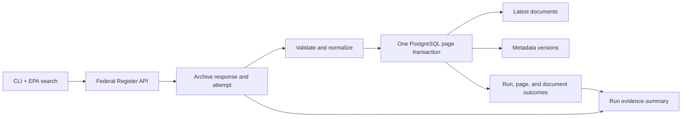

# Federal Register ingest

This package imports Environmental Protection Agency (EPA) rules from the Federal Register into Maiven’s PostgreSQL database. Use it to run an initial or incremental metadata fetch, inspect a run, or understand how source responses become searchable records.

The pipeline stores document metadata only. It does not download the rule-body XML, HTML, or PDFs. For web search behavior, see the web application’s search documentation.

## Get started

### Requirements

Before you run an ingest, make sure you have:

- Python 3.11 or later and `uv`.
- Node.js and `pnpm`, as used by the repository.
- `DATABASE_URL` configured in the repository’s root `.env.local` file, which Varlock loads automatically.
- The checked-in database migrations applied.

### Prepare the database and package

From the repository root, apply migrations and install the ingest package with its test tools:

```sh
pnpm db:migrate
uv sync --project pipelines/ingest --extra dev
```

### Run the default ingest

Run the repository wrapper. It starts the CLI through Varlock, which injects `DATABASE_URL`. The `@maiven/db` package sets Varlock’s `loadPath` to the repository root, so Varlock automatically loads the root `.env.schema` and `.env.local`; you do not need to pass a path:

```sh
./scripts/ingest.sh
```

The default run targets 100 unique documents and requests 100 results per API page. The CLI prints a JSON run summary. It exits with code `0` when the run succeeds, `1` when it fails, and `2` when it stops at the Federal Register result ceiling before reaching its target.

## Choose a run scope

The unique-document target and API page size are independent. `--max-unique-documents` sets the number of distinct document numbers to store; `--per-page` sets the page size requested from the API.

For example, to target 500 unique documents and request 500 results per page:

```sh
./scripts/ingest.sh --max-unique-documents 500 --per-page 500
```

The CLI accepts these options:

- `--max-unique-documents N`: positive unique-document target; default `100`.
- `--per-page N`: positive API page size from `1` to `1000`; default `100`.
- `--publication-date-gte YYYY-MM-DD`: include documents on or after this publication date.
- `--publication-date-lte YYYY-MM-DD`: include documents on or before this publication date.
- `--new-run`: start a separate run instead of resuming the latest incomplete run.

The Federal Register search has a 2,000-source-record ceiling. If a run reaches that ceiling before its unique target, it ends `partial` and exits `2`. Use bounded publication-date ranges to collect larger histories across multiple runs. A date-range change creates a different query fingerprint.

The workflow resumes the latest incomplete run when its query fingerprint matches. If an incomplete run has a different fingerprint, the CLI asks you to use `--new-run`. That option supersedes prior incomplete runs. A PostgreSQL advisory lock prevents concurrent ingest writers.

## Follow data through the pipeline



Each response is archived before parsing. The archive preserves the complete body and its SHA-256 up to the 32 MiB limit; larger responses store a hashed prefix, mark it incomplete, and fail before parsing. Transport failures are recorded separately. The workflow validates and normalizes each source document, then commits the page’s accepted documents, version snapshots, run links, counters, and next-page checkpoint in one database transaction. If that transaction fails, none of those database changes commit.

The main code paths are:

| Path | Responsibility |
|---|---|
| `src/maiven_ingest/cli.py` | Arguments, settings, database connection, exit codes |
| `src/maiven_ingest/federal_register/client.py` | HTTP paging, retries, response capture, API validation |
| `src/maiven_ingest/archive.py` | Append-only response and transport evidence |
| `src/maiven_ingest/document_contract.py` | Field lists, validation, and serving-row normalization |
| `src/maiven_ingest/repository.py` | Persistence port and run/page data contracts |
| `src/maiven_ingest/workflow.py` | EPA search definition, lock, resume, page loop, evidence summary |
| `src/maiven_ingest/db.py` | PostgreSQL adapter, atomic page commit, and run persistence |
| `tests/` | Unit and PostgreSQL integration coverage |

### Persistence boundary

The workflow depends on the `IngestRepository` protocol. `repository.py` defines that
contract and the run/page data objects; `db.py` implements it with
Psycopg. This keeps API paging and run orchestration independent of SQL.

`commit_page()` persists one accepted page in a single transaction:

1. Lock the run row and verify the page number matches the checkpoint.
2. Deduplicate document numbers and apply the run target.
3. Upsert latest document rows and source versions.
4. Write the page manifest, document links, counters, and next checkpoint.

The workflow enters `ingest_lock()` before run setup and exits after summary
generation. The PostgreSQL adapter acquires and releases the session-level advisory
lock in that context manager. Page transactions use the same connection, so a page
commit does not release the run lock.

## Inspect stored data and run evidence

The database stores the latest document projection in `documents`. Each distinct source metadata payload is retained in `document_versions`, keyed by document number and canonical JSON SHA-256. `ingest_runs` stores run state and counters; `ingest_run_pages` records committed pages; `ingest_run_documents` links each accepted source document and outcome to its page and source version.

The CLI summary combines the PostgreSQL run report with local evidence. The evidence directory is `data/raw/federalregister/run_id=<run-id>/`:

- `responses.jsonl`: request and response metadata, body, completeness, encoding, and body hash. Invalid UTF-8 bodies are base64-encoded so their bytes remain recoverable.
- `transport_failures.jsonl`: attempts that failed before a complete HTTP response was available.

Structured diagnostics append to `logs/ingest.jsonl`. Logs are for operations; the raw response archive is the source evidence. Keep both paths out of version control.

## Configure HTTP behavior

Set these optional environment variables in the root `.env.local` file when the defaults do not fit your environment. Varlock loads that file for the command above:

| Variable | Default | Purpose |
|---|---:|---|
| `FEDERAL_REGISTER_API_BASE_URL` | Federal Register API URL | API base URL |
| `FEDERAL_REGISTER_CONNECT_TIMEOUT` | `5` seconds | Connection timeout |
| `FEDERAL_REGISTER_READ_TIMEOUT` | `30` seconds | Response read timeout |
| `FEDERAL_REGISTER_MAX_RETRIES` | `3` | Retry limit for transient failures |
| `FEDERAL_REGISTER_BACKOFF_INITIAL` | `1` second | Initial retry delay |
| `FEDERAL_REGISTER_BACKOFF_MAX` | `30` seconds | Maximum exponential backoff |
| `FEDERAL_REGISTER_RETRY_AFTER_MAX` | `60` seconds | Maximum delay accepted from `Retry-After` |
| `FEDERAL_REGISTER_MAX_RESPONSE_BYTES` | `33554432` bytes | Maximum response size (32 MiB) |
| `FEDERAL_REGISTER_USER_AGENT` | `maiven-takehome-ingest/0.1` | HTTP `User-Agent` value |

When a response exceeds the size limit, the client archives a bounded prefix and fails the attempt.

## Run tests

Run unit tests from the repository root:

```sh
uv run --project pipelines/ingest --extra dev pytest pipelines/ingest/tests
```

The PostgreSQL integration test runs only when `INGEST_TEST_DATABASE_URL` points to an isolated database with migrations applied. The database name must contain `test`; the test refuses other names. Use a disposable test database, never the application database. The test uses unique document numbers and removes only its own rows.

## Schedule daily refreshes

The repository includes `scripts/ingest-daily.sh`, which invokes `scripts/ingest.sh` with the default 100-document target. A scheduler must invoke the script; the script does not install or enable cron. Set an absolute repository path and a `PATH` containing `pnpm` and `uv` in the scheduler environment.

The web API’s freshness timestamp means an ingest completed successfully. It does not mean the run revisited every historical document.

## Assumptions and decisions

- **Latest-row null policy:** every mapped field replaces its previous value on upsert. Source `null` values and omitted optional fields normalized to `null` clear the latest row. Version snapshots preserve the original JSON shape, so omitted and explicit-null values remain distinguishable. Revisit this policy if consumers need to distinguish “unknown” from “cleared.”
- **Text cleanup:** normalization trims and collapses whitespace in titles and abstracts. It does not strip markup or decode HTML entities. The raw source payload remains available in `document_versions`.
- **Single ingest writer:** use one global PostgreSQL session advisory lock because PostgreSQL is already the shared coordination point for runners writing to the same database. The cursor only sends the lock SQL; PostgreSQL ties lock ownership to the connection session, so page commits do not release it. Acquire it before run setup and hold it through the final summary. A competing runner fails immediately. The global key also serializes different query/date ranges, which is acceptable while ingestion is sequential. Trade-offs: each run holds a database connection, and advisory locks are cooperative—writers that do not acquire this key are not blocked. The explicit unlock runs after the summary; PostgreSQL also releases the lock when the connection closes, so an interrupted run can resume from its last committed checkpoint.
- **Version history:** the ingest stores each distinct metadata payload it observes. Existing rows gain a first version when a future run sees them; no historical archive backfill runs automatically.
- **Version validation:** live runs verified initial snapshots and run-to-version links for 2,100 documents, but did not observe a repeated document with changed source metadata. A controlled PostgreSQL integration test verifies that a changed payload creates a new version and links the new run to it. Live source changes remain unverified.
- **Update counts:** `updated_records` counts upserts to existing rows, including identical metadata. It does not mean a field changed.
- **Search indexing:** title and abstract use PostgreSQL English full-text search with a matching Generalized Inverted Index (GIN) expression index. This supports token and stem matching; see the database migration and web search implementation for query details.

## Related files

- Database schema and migrations: `packages/db/src/schema.ts` and `packages/db/drizzle/`.
- Daily runner: `scripts/ingest-daily.sh`.
- Manual runner: `scripts/ingest.sh` (forwards CLI options).
- Web API and search: `apps/web/app/api/documents/` and `apps/web/lib/documents/`.
